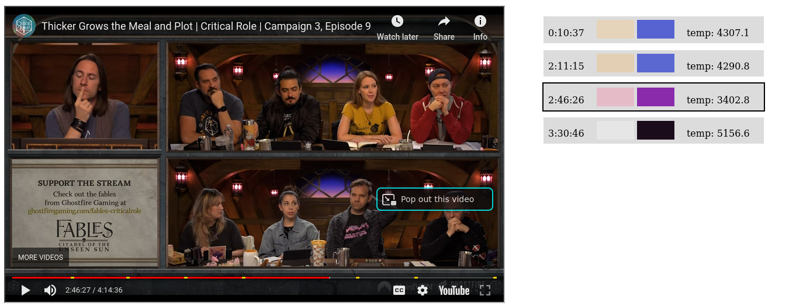

‼️**With the release of [beacon](https://beacon.tv/), this project would require a complete re-write to support the timestamps from there. Take this as a proof-of-concept.**‼️

---

Extract color :rainbow: from the Critical Role set lights.

> You can try out this demo [live in your browser](https://bauersimon.github.io/critrolehue/).

The goal of this project is to have an automatic way of extracting color from the Critical Role ambient lights. Please note that the color extraction is **not real-time**.

## Components

### :microscope: `extractor` (`python`)

- extracts colors and saves them to `json`
- [this little technical slide deck gives an abstract overview](https://docs.google.com/presentation/d/e/2PACX-1vS42vjidmfR-c_pF3WUeojw-l25jv1xyqiYwAY1syjcCvkgWOrHTKnAytf2k_sLbU15zHwDgDEhuPNi/pub?start=false&loop=false&delayms=60000)
- all color data for campaign 3 is [visualized online](https://bauersimon.github.io/critrolehue/data/v1/c3/)

### :floppy_disk: GitHub Pages
- host extracted colors (so it can be used by other tools)
- `json` data for an episode can be found at:
  - `bauersimon.github.io/critrolehue/data/v1/c3/<youtube-id>.json`
  - example: `bauersimon.github.io/critrolehue/data/v1/c3/POgfa65vi4k.json`
  - `bauersimon.github.io/critrolehue/data/v1/c3/C3EXXX_<youtube-id>.json` (alternative)
  - example: `bauersimon.github.io/critrolehue/data/v1/c3/C3E003_POgfa65vi4k.json`
- automatically extract colors for new episodes of campaign 3 as they are released
  - at 12pm and 1pm (PT) every Monday (in case the episode is late)
  - can take up to 30 Minutes on the free-tier GitHub runners
  - requires the new episode to be in the [YouTube playlist](https://www.youtube.com/playlist?list=PL1tiwbzkOjQydg3QOkBLG9OYqWJ0dwlxF)

### :electric_plug: `connector` (`golang`)
- demo/proof-of-concept command line application that synchronizes the colors with Philips Hue when watching an episode
- requires one to **manually** specify the starting timestamp when watching an episode, i.e.:
  - open episode in YouTube
  - pause episode, copy URL and remember current timestamp
  - run the `connector` in the terminal and insert URL and timestamp
  - quickly head back to YouTube and resume playback so they don't go out of sync
- see the "Releases" section for pre-built binaries (only tested on linux)
- the following commands are available
  - `setup`: walks you through a setup with your local Philips Hue bridge, will ask how to assign your bulbs
    - `hue` indices available:
      - `1` lamps in the studio
      - `2` background window
    - `temperature` indices available: `1` global temperature
  - `run`: start synchronizing
    - `--url "http://..."` of the episode (should use quotes so your terminal does not confuse any special characters within the url)
    - `--offset 01h45m35s` optional starting point
    - check `run --help` for details

## Future Ideas

- improve usability of `connector`, support more lighting systems and **true** synchronization (i.e. by extracting the timing information from a browser)
- make it easier to create, edit and store masks/`json` to also support other shows easily (i.e. one-shots or "Candela Obscura")
- train a small BERT model with Matt's scene descriptions and the color information from campaign 3 to generate color information for campaigns 1 and 2 as well

---

:heavy_exclamation_mark: **Disclaimer** - This project is not directly associated with "Critical Role" and they own all the rights on their content. :heavy_exclamation_mark:
